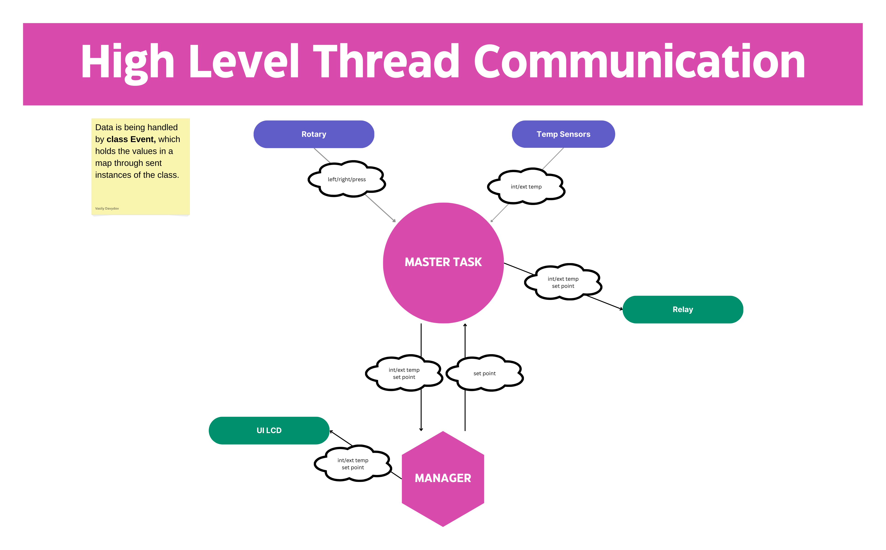

# SHOH-Innovation-Project
Smart Home Oil Heater is a project for Metropolia UAS course called Multidisciplinary Innovation Project.

## Tasks communication:


## Event communication flow:
```
Temp Sensors  -->  Master  -->  Manager & Relay
Rotary        -->  Master  -->  Manager
Manager       -->  Master  -->  Relay
Manager       -->  UI LCD
```

